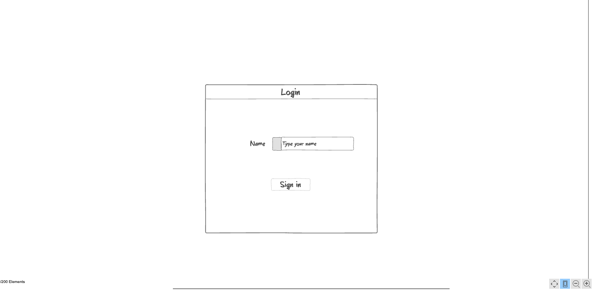
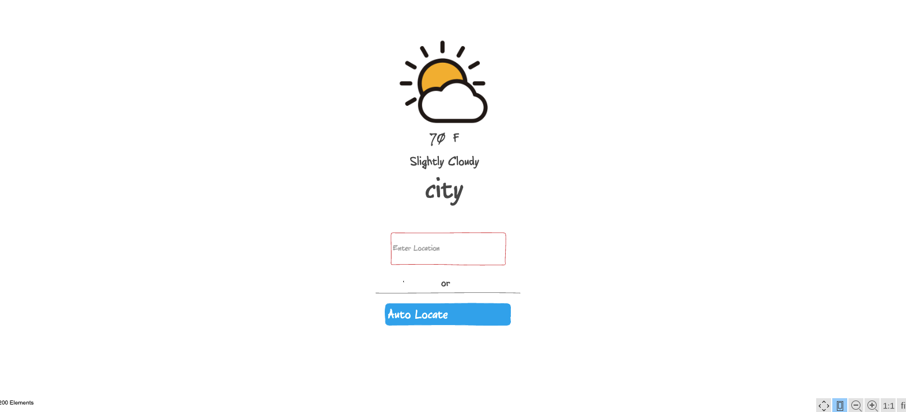

# startup

see [Notes](https://github.com/andymam/startup/blob/main/notes.md)

## Idea: Weather App

My startup idea will be a weather app that allows a user to login and check the weather in either their current location, or any location they choose to input. 

This app will have features such as degrees, current weather conditions, and an about page.

I will be using certain technologies such as:

- **Authentication**: by having the user log in, using their name
- **Database data**: my application will display weather data that will come from a database
- **WebSocket data**: real time weather will be shown, so it will update with time, and provide current conditions

### Design

